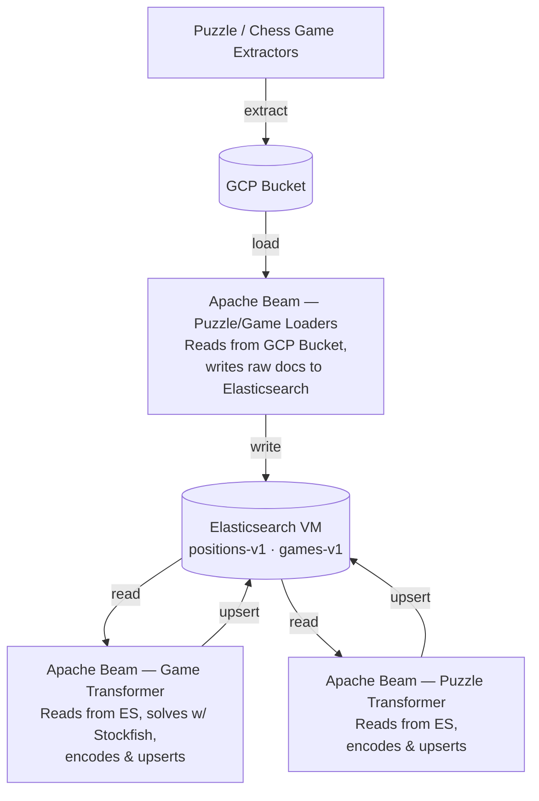
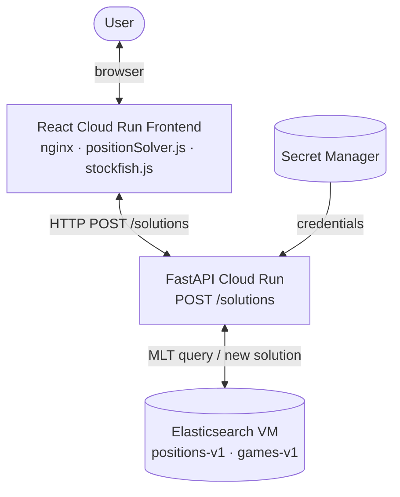

# chess-gcp-infrastructure

Infrastructure-as-code for the Chess Thesaurus application stack on Google Cloud Platform. 

## Overview

Manages all GCP resources for the chess application ecosystem, including compute, networking, secrets, and container deployments. Built with Terraform/Terragrunt and Packer.

## Architecture
### ETL Pipeline

Puzzle and game data is extracted from external sources, staged in GCP, then transformed and loaded into Elasticsearch by Apache Beam pipelines.



---

### Runtime Architecture

At query time the React frontend submits a solved position to the FastAPI service, which runs a More Like This query against Elasticsearch and returns similar positions.
We use a fancy Gaussian/Softmax algorithm to combine results amongst multi solution query positions to single solution puzzles.



---


## Repository Structure
Do you really need to me run `tree` to see this? Cant you just look at the github files?? OK fine...

 ```text
  tree .
.
├── CLAUDE.md
├── elastic-instructions.txt
├── environments
│   ├── dev
│   │   └── terragrunt.hcl
│   └── prod
│       ├── app
│       │   └── terragrunt.hcl
│       ├── backend.tf
│       ├── load-balancer
│       │   └── terragrunt.hcl
│       └── terragrunt.hcl
├── modules
│   ├── app
│   │   ├── backend.tf
│   │   ├── cloudbuild.tf
│   │   ├── cloudrun.tf
│   │   ├── data.tf
│   │   ├── dataflow.tf
│   │   ├── elasticsearch.tf
│   │   ├── locals.tf
│   │   ├── managed_elasticsearch.tf
│   │   ├── network.tf
│   │   ├── outputs.tf
│   │   ├── provider.tf
│   │   ├── storage.tf
│   │   └── variables.tf
│   └── load-balancer
│       ├── main.tf
│       ├── outputs.tf
│       ├── provider.tf
│       └── variables.tf
├── packer
│   ├── elasticsearch-dev.pkr.hcl
│   └── elasticsearch-prod.pkr.hcl
├── README.md
└── runbooks
    ├── es-disk-migration.md
    └── es-migration-vm-to-managed.md

11 directories, 29 files

```

## Prerequisites

- Terraform v1.14.4
- Terragrunt v0.99.2
- `packer` >= v1.15.0
- GCP project - each environment goes in its own project 

You will need to manually turn on all API/Services after creating a new project. You will also need to manually create a terraform service account. Unless you want to make another terraform project to make this terraform project's SA. But then you'll need another project to make that one's SA account...
### Terraform SA 
You'll need to create a terraform service account and give terragrunt access (I used a SA key for local deployments). I opted to just do this manually - I only had two environments (dev and prod), though one day if I'm feeling spicy I might get
a staging environment. Currently it uses the following permissions: 
| Role |
|------|
| Artifact Registry Administrator |
| Artifact Registry Repository Administrator |
| Cloud Build Connection Admin |
| Cloud Build Editor |
| Cloud Run Admin |
| Compute Admin |
| Project IAM Admin |
| Pub/Sub Admin |
| Secret Manager Admin |
| Serverless VPC Access Admin |
| Serverless VPC Access Service Agent |
| Service Account Admin |
| Service Account User |
| Storage Admin |
## Usage

### Apply infrastructure
```bash
cd terragrunt/prod
terragrunt run-all apply
```
You will need a github auth token so cloudbuild can actually the code from github, or wherever. 

### Build a new Elasticsearch VM image
```bash
cd packer
packer build elasticsearch.pkr.hcl
```

### Taint and redeploy the Elasticsearch instance
When you rebuild the ES instance in packer you'll need to taint ES so it picks up the changes. This probably isn't something you want to automate because it means downtime. 
```bash
cd terragrunt/prod/compute
terragrunt state list
terragrunt taint <resource>
terragrunt apply
```
### Deploy New Elasticsearch snapshot
Man are you still reading?? Good for you! Why not read the runbook in runbooks? 
